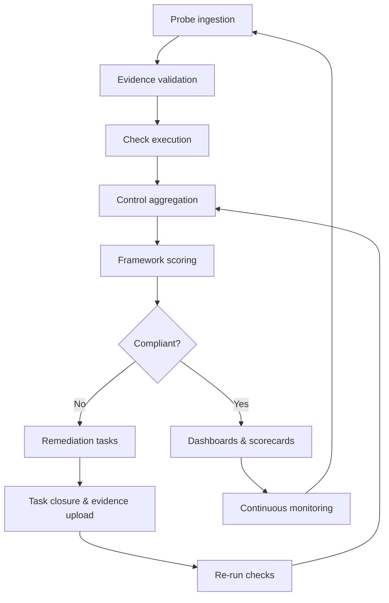

# Governance Engine <!-- omit in toc -->

## Location: /server/src/modules/governance

>### TL;DR
> The governance engine is the platform core that turns evidence into actionable compliance intelligence.
> Located at `server/src/modules/governance`, it executes checks, aggregates control and framework scores, and drives remediation workflows.
> This guide explains lifecycle orchestration, execution internals, extensibility hooks, and system dependencies.

---

- [1. Module Overview](#1-module-overview)
- [2. End-to-End Lifecycle](#2-end-to-end-lifecycle)
  - [2.1 Lifecycle Narrative](#21-lifecycle-narrative)
- [3. Execution Model inside `server/src/modules/governance`](#3-execution-model-inside-serversrcmodulesgovernance)
  - [3.1 Check Runners](#31-check-runners)
  - [3.2 Control Aggregation](#32-control-aggregation)
  - [3.3 Remediation Orchestration](#33-remediation-orchestration)
- [4. Logging, Reporting, and Audit Trails](#4-logging-reporting-and-audit-trails)
- [5. Extensibility Hooks](#5-extensibility-hooks)
  - [5.1 Adding New Checks or Probes](#51-adding-new-checks-or-probes)
  - [5.2 Adjusting Control Weightings and Scoring Logic](#52-adjusting-control-weightings-and-scoring-logic)
- [6. Dependencies and System Interactions](#6-dependencies-and-system-interactions)

---

## 1. Module Overview
- **Location:** `server/src/modules/governance` sits inside the feature-oriented backend directory layout, alongside peers for integrations, middleware, and routes.【F:docs/02-technical-specifications/02-backend-architecture-and-apis.md†L55-L63】
- **Purpose:** The module is the core compliance processor that ingests evidence, evaluates checks, aggregates control health, scores frameworks, and produces risk intelligence.【F:docs/02-technical-specifications/02-backend-architecture-and-apis.md†L90-L102】【F:docs/01-about/03-concept-summary.md†L214-L302】
- **Primary responsibilities:**
  - Execute governance checks defined against regulatory or internal policies.【F:docs/02-technical-specifications/02-backend-architecture-and-apis.md†L92-L103】【F:docs/01-about/03-concept-summary.md†L243-L252】
  - Aggregate check outcomes into controls and framework-aligned scorecards for reporting and decision making.【F:docs/02-technical-specifications/02-backend-architecture-and-apis.md†L92-L103】【F:docs/01-about/03-concept-summary.md†L255-L279】【F:docs/02-technical-specifications/04-database-design.md†L91-L94】
  - Trigger remediation tasks, notifications, and audit logging to ensure issues are triaged, resolved, and permanently recorded.【F:docs/02-technical-specifications/02-backend-architecture-and-apis.md†L95-L159】【F:docs/01-about/03-concept-summary.md†L282-L359】【F:docs/02-technical-specifications/04-database-design.md†L96-L99】

## 2. End-to-End Lifecycle
The governance engine orchestrates a closed-loop workflow that starts with probe data and ends with continuous monitoring. The flow below combines asynchronous ingestion, synchronous validation, and feedback-driven remediation:

### 2.1 Lifecycle Narrative
1. **Probe ingestion** – Probes built with the SDK collect configuration, audit, and testing data from customer environments and push structured payloads into the governance engine via authenticated endpoints.【F:docs/02-technical-specifications/07-integration-architecture.md†L68-L90】【F:docs/01-about/03-concept-summary.md†L223-L240】
2. **Evidence validation & normalization** – Incoming payloads are authenticated, schema-validated, and mapped to the correct framework/control context before storage in the evidence repository and relational tables (e.g., `probes`, `checks`, `results`).【F:docs/02-technical-specifications/04-database-design.md†L80-L94】
3. **Check execution** – Each control’s checks run automatically (or require human approval for manual/hybrid cases), producing compliant / non-compliant / partial outcomes recorded alongside evidence references.【F:docs/01-about/03-concept-summary.md†L243-L252】【F:docs/02-technical-specifications/04-database-design.md†L80-L89】
4. **Control aggregation** – The engine aggregates check outputs to compute control compliance percentages, risk ratings, and maturity indicators, surfacing them on dashboards and reports.【F:docs/01-about/03-concept-summary.md†L255-L279】【F:docs/01-about/03-concept-summary.md†L314-L384】
5. **Framework scoring** – Controls are mapped to multiple frameworks, enabling a single result set to drive EU AI Act, ISO 42001, or NIST AI RMF scorecards. Aggregate scores, heatmaps, and reports are written to the `scores` and `metrics` tables for analytics consumption.【F:docs/01-about/03-concept-summary.md†L262-L279】【F:docs/02-technical-specifications/04-database-design.md†L91-L94】
6. **Remediation & tasking** – Failed checks and controls generate remediation tasks with due dates, evidence links, and escalation rules. Task completion triggers control revalidation, closing the feedback loop and updating dashboards and integrations (Jira, ServiceNow, Slack).【F:docs/02-technical-specifications/02-backend-architecture-and-apis.md†L95-L159】【F:docs/01-about/03-concept-summary.md†L282-L359】【F:docs/02-technical-specifications/07-integration-architecture.md†L95-L141】
7. **Monitoring & auditability** – Continuous probe execution re-runs checks, refreshes scores, and appends audit logs, ensuring posture reflects the current production state and remains export-ready for audits or partner APIs.【F:docs/01-about/03-concept-summary.md†L290-L302】【F:docs/02-technical-specifications/04-database-design.md†L96-L99】【F:docs/02-technical-specifications/07-integration-architecture.md†L145-L165】

## 3. Execution Model inside `server/src/modules/governance`
### 3.1 Check Runners
- **Input sources:** Probe events, manual evidence uploads, and webhook triggers resolved to `check` records with typed payloads and timestamps.【F:docs/02-technical-specifications/04-database-design.md†L80-L89】
- **Validation pipeline:**
  1. Authenticate request and attach tenant + framework metadata.
  2. Apply schema validation and normalization (e.g., severity enums, timestamp coercion).
  3. Invoke check-specific logic (scripted rule, threshold comparison, or manual review queue).
  4. Persist `results` row and link to evidence entries for traceability.【F:docs/02-technical-specifications/04-database-design.md†L80-L99】
- **Outcome logging:** Every execution writes to the audit log subsystem with actor, source, and outcome to support investigations and compliance attestations.【F:docs/02-technical-specifications/02-backend-architecture-and-apis.md†L95-L103】【F:docs/02-technical-specifications/04-database-design.md†L96-L99】

### 3.2 Control Aggregation
- **Rollup mechanics:** Controls subscribe to a set of checks; the engine computes compliance percentages by weighting pass/fail states, severity, and freshness of evidence. Results are persisted to the `scores` table and surfaced in dashboards and exports.【F:docs/01-about/03-concept-summary.md†L255-L279】【F:docs/02-technical-specifications/04-database-design.md†L91-L94】
- **Risk categorization:** Controls produce risk ratings (e.g., critical/major/minor) feeding observations, gap analyses, and remediation priorities.【F:docs/01-about/03-concept-summary.md†L326-L347】
- **Framework mapping:** Mappings maintained by the Framework Service let one control satisfy multiple obligations. The governance engine reuses these relationships when generating framework-specific views or partner API payloads.【F:docs/02-technical-specifications/02-backend-architecture-and-apis.md†L106-L118】【F:docs/01-about/03-concept-summary.md†L262-L279】

### 3.3 Remediation Orchestration
- **Task generation:** Failed controls trigger records in the Task Service with status, ownership, due dates, and escalation metadata; evidence links tie remediation artifacts back to the originating control.【F:docs/02-technical-specifications/02-backend-architecture-and-apis.md†L95-L165】【F:docs/01-about/03-concept-summary.md†L282-L359】
- **Workflow automation:** Integrations send tickets or alerts to ServiceNow, Jira, or Slack, keeping external systems synchronized during remediation and approvals.【F:docs/02-technical-specifications/07-integration-architecture.md†L95-L141】
- **Closure & revalidation:** Task closure triggers re-execution of linked checks; success updates control scores and clears open observations for audit records.【F:docs/01-about/03-concept-summary.md†L282-L359】【F:docs/02-technical-specifications/04-database-design.md†L96-L99】

## 4. Logging, Reporting, and Audit Trails
- **Audit logs:** Every governance operation (probe ingestion, check outcome, control update, task state change) appends immutable entries with actor, timestamp, and payload summary for downstream analytics and audits.【F:docs/02-technical-specifications/02-backend-architecture-and-apis.md†L95-L103】【F:docs/02-technical-specifications/04-database-design.md†L96-L99】
- **Score & metric storage:** Control and framework scores, trend metrics, and dashboard KPIs are persisted for historical analysis and visualizations consumed by the reporting layer.【F:docs/01-about/03-concept-summary.md†L269-L384】【F:docs/02-technical-specifications/04-database-design.md†L91-L94】
- **Evidence repository links:** Each result references evidence artifacts housed in MinIO and relational metadata tables, guaranteeing traceability from every score back to raw proof.【F:docs/02-technical-specifications/02-backend-architecture-and-apis.md†L121-L134】【F:docs/02-technical-specifications/04-database-design.md†L86-L89】
- **Partner API and exports:** The module exposes scorecards, audit logs, and compliance data through role-scoped APIs, enabling regulators, partners, and enterprise data lakes to consume governance telemetry securely.【F:docs/02-technical-specifications/07-integration-architecture.md†L145-L165】

## 5. Extensibility Hooks
### 5.1 Adding New Checks or Probes
1. **Define probe data contract** using the Probe SDK (fields, authentication, retries) to send evidence payloads to the governance engine.【F:docs/02-technical-specifications/07-integration-architecture.md†L68-L90】
2. **Register check metadata** in the `checks` table, linking it to the relevant control, probe, and framework mappings.【F:docs/02-technical-specifications/04-database-design.md†L80-L94】
3. **Implement check logic** within the governance module (new validator, rule script, or manual review workflow) and map it to routing/middleware entries under `server/src/routes`.【F:docs/02-technical-specifications/02-backend-architecture-and-apis.md†L55-L103】
4. **Update control configuration** to include weighting, severity, and notification preferences so aggregated scoring reflects the new signal.【F:docs/01-about/03-concept-summary.md†L255-L347】
5. **Extend integration hooks** (optional) to push failures into task or notification systems for remediation tracking.【F:docs/02-technical-specifications/02-backend-architecture-and-apis.md†L95-L165】【F:docs/02-technical-specifications/07-integration-architecture.md†L95-L141】

### 5.2 Adjusting Control Weightings and Scoring Logic
- **Control metadata:** Modify control definitions to adjust severity, weight, or maturity thresholds; changes immediately influence rollups in the `scores` table and downstream dashboards.【F:docs/01-about/03-concept-summary.md†L255-L384】【F:docs/02-technical-specifications/04-database-design.md†L91-L94】
- **Framework mappings:** Update mapping records so adjusted controls cascade to every linked framework requirement without duplicative effort.【F:docs/02-technical-specifications/02-backend-architecture-and-apis.md†L106-L118】
- **Reporting calibration:** Reconfigure dashboard widgets or partner API filters to surface new weighting logic or thresholds for auditors and business stakeholders.【F:docs/01-about/03-concept-summary.md†L269-L384】【F:docs/02-technical-specifications/07-integration-architecture.md†L145-L165】

## 6. Dependencies and System Interactions
- **Probes:** Supply raw evidence via the Probe SDK and integrations, forming the input stream for checks and controls.【F:docs/02-technical-specifications/07-integration-architecture.md†L68-L118】【F:docs/01-about/03-concept-summary.md†L223-L240】
- **Checks:** Encapsulate validation logic stored alongside probes and controls, with outcomes feeding aggregation and logging workflows.【F:docs/02-technical-specifications/04-database-design.md†L80-L89】【F:docs/01-about/03-concept-summary.md†L243-L252】
- **Controls & Frameworks:** Provide the aggregation and mapping layers that translate raw check data into cross-framework compliance insights.【F:docs/02-technical-specifications/02-backend-architecture-and-apis.md†L90-L118】【F:docs/01-about/03-concept-summary.md†L255-L279】
- **Tasks & Notifications:** Downstream services consume governance engine events to create, assign, and escalate remediation tasks while alerting stakeholders through channels like Jira, ServiceNow, and Slack.【F:docs/02-technical-specifications/02-backend-architecture-and-apis.md†L95-L159】【F:docs/02-technical-specifications/07-integration-architecture.md†L95-L141】
- **Evidence Repository & Audit Logs:** Ensure every compliance decision is backed by immutable records accessible to auditors and partner systems.【F:docs/02-technical-specifications/02-backend-architecture-and-apis.md†L121-L134】【F:docs/02-technical-specifications/04-database-design.md†L86-L99】

Together, these components enable the governance engine to deliver continuous, measurable, and auditable AI compliance across the platform.

---

[← Previous](10-evidence-management-system.md) | [Next →](12-task-management-system.md)
