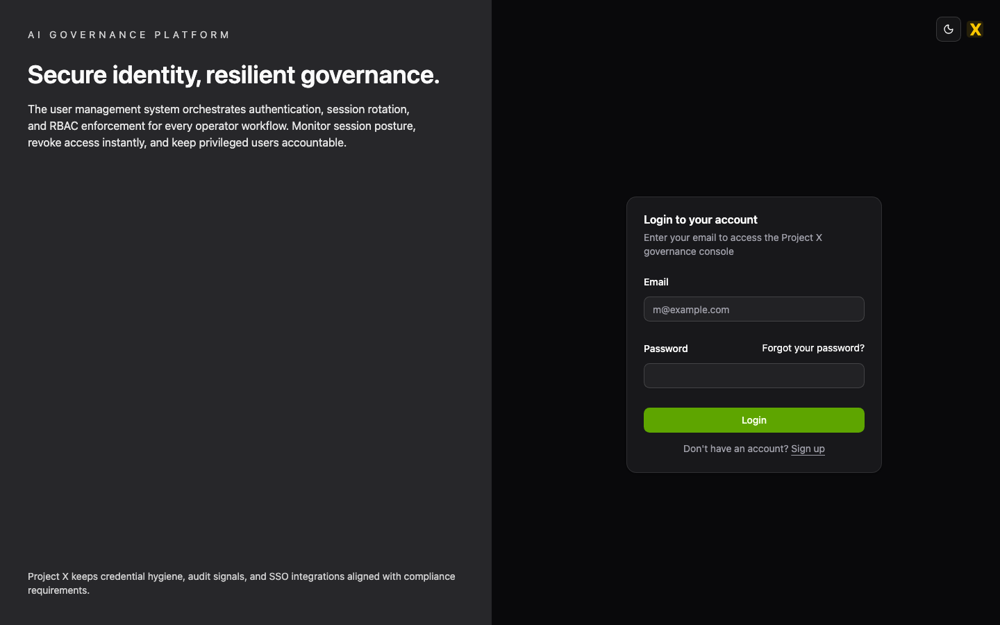
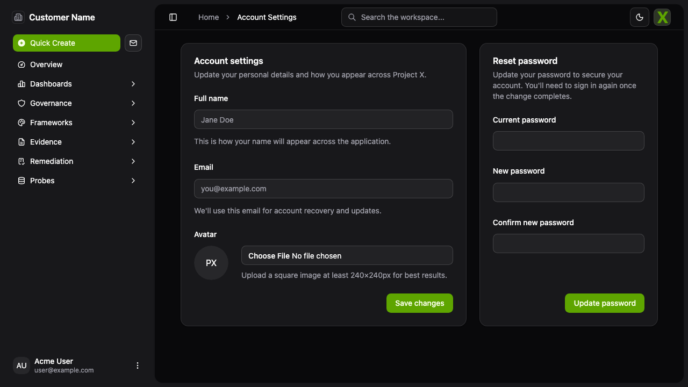
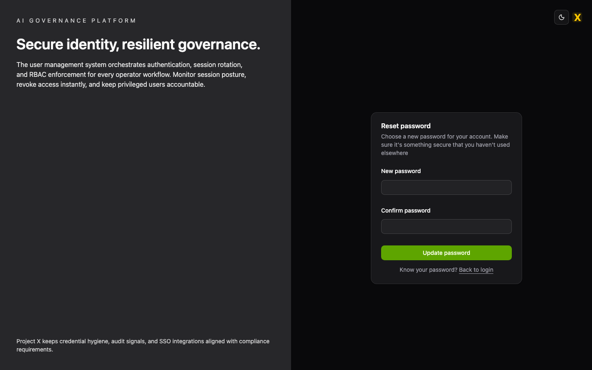

# Access & Authentication Guide

## Overview
This guide explains how to enter Project X, update your credentials, and recover access when you lose your password. Use it before you onboard to any specific workspace so you can reach the Governance, Evidence, Reporting, or Admin consoles without delays.

## Logging in

1. Navigate to your workspace URL (e.g., `https://projectx.yourorg.ai`) and click **Sign in**.
2. Enter the email address tied to your `AuthUser` record and the password your organization provided.
3. If your organization enforces MFA, approve the push or enter the OTP code before the session begins.
4. Upon success, you land on the **Dashboard**; the sidebar auto-expands to expose role-relevant links (Governance, Probes, Admin, etc.).

> Tip: Bookmark the sidebar entry for your most-used workspace (Governance Overview, Evidence Library, or Access Control). Users with multiple roles often pin two tabs—one for compliance and one for operations.

## Changing your password

1. Open your avatar menu (top-right) and choose **Settings → Security**.
2. Under **Password**, enter your current password and then the new password twice. The system enforces the current corporate strength policy (minimum length + mix of types).
3. Click **Save**; the backend updates the hashed password in `auth_users` and revokes any active refresh tokens for security.
4. You receive a confirmation toast; future sign-ins must use the new password.

> Note: If you maintain service tokens (`/admin/service-tokens`), you do not need to rotate them when updating your password unless the token has a direct dependency on the previous password hash.

## Resetting a forgotten password

1. From the login page, click **Forgot password?**.
2. Enter the email associated with your account and submit the form. The backend generates a short-lived token (`auth_password_resets`) with a secure hash.
3. Check your inbox for the reset link, then follow it to load the reset page.
4. Provide a new password (twice) and submit; the platform invalidates the token and signs you in (or you can return to the login page manually).

> Troubleshoot: If you never receive the email, confirm your SMTP settings via the Admin console or ask your Security Administrator to inspect `server/src/integrations/mailer.js` logs.

## Additional help
- If your account is locked, ask an Admin to review the `auth_role_assignments` table; expired or revoked assignments trigger lockouts.
- For MFA issues, regenerate your authenticator codes by visiting **Settings → Security → Regenerate MFA** or contact Ops to disable MFA temporarily.
- Keep `.env` variables (especially SMTP and session secrets) consistent between server and client so login flows and password resets behave identically in dev and production.
